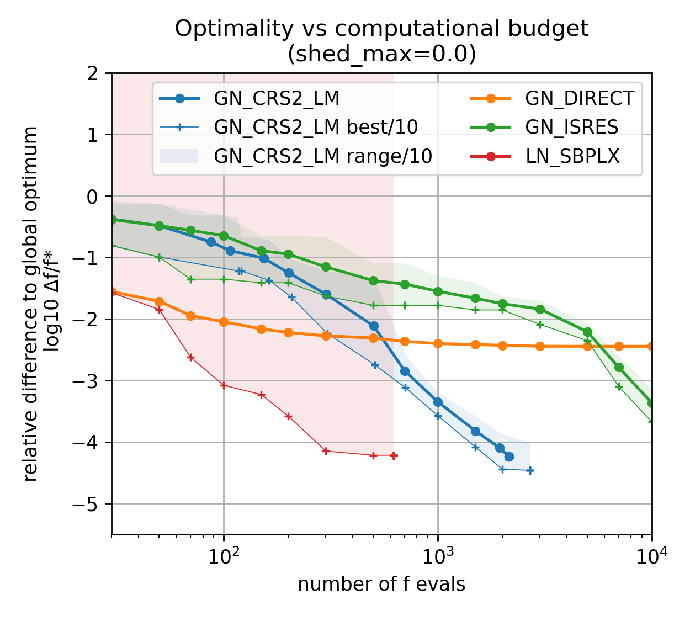
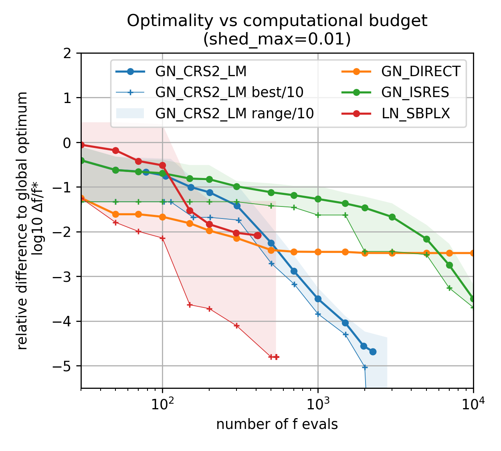

# Benchmark of optimization algorithms for Microgrid sizing

*PH, October 2023*

Tools:

- Microgrids.jl
- optimizers from NLopt.jl

## Results

(used in the Julia Optimization Days 2023 poster)

Among NLopt.jl derivative free optimizers, the two which stands out are:

- DIRECT for a medium number of iterations
- CRS2 for more iterations.

